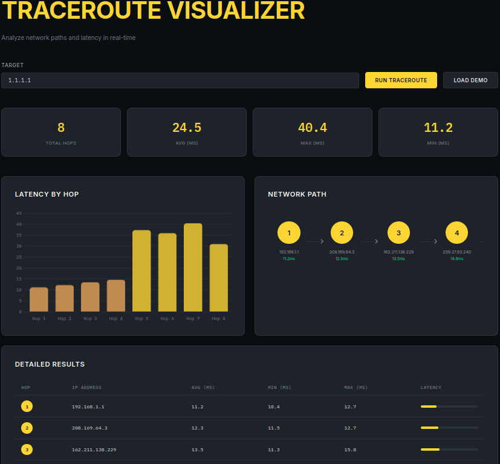

# Traceroute Visualizer

Network path analysis tool with real-time latency visualization. Run traceroute commands from a web interface or CLI, view hop-by-hop latency data, and export results.



## Key Features

- **Web Interface** - Modern Binance-inspired dark UI with yellow accent colors
- **CLI Tool** - Terminal-based traceroute with text tables and optional matplotlib graphs
- **Real-time Visualization** - Interactive latency charts powered by Chart.js
- **Network Path Display** - Visual node-by-node path representation
- **Demo Mode** - Test the interface without running actual traceroute commands
- **Export Support** - JSON export for further analysis

---

## Tech Stack

- **Backend**: Python 3.8+ with Flask
- **Frontend**: Vanilla JavaScript, Chart.js
- **CLI**: Python with optional matplotlib/rich for enhanced output
- **System**: Linux `traceroute` or Windows `tracert`

---

## Prerequisites

- Python 3.8 or higher
- `traceroute` command (Linux) or built-in `tracert` (Windows)
- pip (Python package manager)

---

## Getting Started

### 1. Clone the Repository

```bash
cd /home/god/Downloads/traceroute
```

### 2. Install Python Dependencies

```bash
# Server dependencies
pip install flask flask-cors

# CLI dependencies (optional)
pip install matplotlib rich
```

### 3. Install System Traceroute

**Linux (Ubuntu/Debian):**
```bash
sudo apt-get install traceroute
```

**Linux (Fedora/RHEL):**
```bash
sudo dnf install traceroute
```

**macOS:**
```bash
brew install traceroute
```

**Windows:** Built-in `tracert` command (no installation needed)

### 4. Start the Web Server

```bash
# Option 1: Using the startup script
./run_server.sh

# Option 2: Direct Python execution
python3 traceroute_server.py
```

The server starts at `http://localhost:5000`

### 5. Open the Web Interface

Navigate to `http://localhost:5000` in your browser and:
1. Enter a target hostname or IP (e.g., `google.com`)
2. Click "Run Traceroute"
3. View latency data, network path, and detailed results

---

## Architecture

### Directory Structure

```
traceroute/
├── traceroute_server.py      # Flask web server
├── traceroute_visualizer.py  # CLI traceroute tool
├── traceroute_visualizer.html # Web UI (Binance design)
├── run_server.sh             # Startup script
├── CLAUDE.md                 # AI assistant context
└── README.md                 # This file
```

### Component Overview

| File | Purpose |
|------|---------|
| `traceroute_server.py` | Flask server with `/api/traceroute` endpoint, serves static HTML |
| `traceroute_visualizer.py` | CLI tool with text/rich tables, matplotlib graphs, JSON export |
| `traceroute_visualizer.html` | Standalone frontend (Chart.js), calls API endpoints |
| `run_server.sh` | Startup script with dependency checks |

### Request Lifecycle

1. User enters target in web form
2. Frontend sends `GET /api/traceroute?target=<host>`
3. Server runs system `traceroute` command
4. Output parsed into hop dictionaries
5. JSON response rendered in UI

### Data Flow

```
User Input → Flask API → subprocess(traceroute) → Parse Output → JSON Response
                                                               ↓
                                      Chart.js + DOM Update ← Frontend
```

---

## Available Commands

### Web Server

```bash
# Start server
python3 traceroute_server.py
./run_server.sh
```

### CLI Tool

```bash
# Basic text output
python3 traceroute_visualizer.py google.com

# With latency graph (requires matplotlib)
python3 traceroute_visualizer.py google.com --graph

# With network map visualization
python3 traceroute_visualizer.py google.com --map

# All visualizations
python3 traceroute_visualizer.py google.com --all

# Demo mode with sample data
python3 traceroute_visualizer.py --demo --graph

# Export to JSON
python3 traceroute_visualizer.py google.com --export results.json
```

---

## Environment Variables

| Variable | Description | Default |
|----------|-------------|---------|
| `FLASK_ENV` | Flask environment | `development` |
| `FLASK_PORT` | Server port | `5000` |
| `FLASK_HOST` | Server host | `0.0.0.0` |

---

## API Reference

### `GET /api/traceroute`

Run traceroute on target host.

**Parameters:**
| Parameter | Type | Description |
|-----------|------|-------------|
| `target` | string | Hostname or IP address (required) |

**Response:**
```json
{
  "hops": [
    {
      "hop": 1,
      "ip": "192.168.1.1",
      "times": [1.2, 1.1, 1.3],
      "avg_time": 1.2
    }
  ]
}
```

### `GET /api/health`

Health check endpoint.

**Response:** `{"status": "ok"}`

---

## Testing

```bash
# Test server health
curl http://localhost:5000/api/health

# Run demo traceroute
curl "http://localhost:5000/api/traceroute?target=google.com"

# CLI test (requires traceroute installed)
python3 traceroute_visualizer.py --demo --graph
```

---

## Troubleshooting

### `traceroute` command not found

**Linux:**
```bash
sudo apt-get install traceroute  # Debian/Ubuntu
sudo dnf install traceroute      # Fedora/RHEL
```

**macOS:**
```bash
brew install traceroute
```

**Windows:** Use built-in `tracert` (no installation needed)

### Flask not installed

```bash
pip install flask flask-cors
```

### Port 5000 already in use

Change the port in `traceroute_server.py`:
```python
if __name__ == '__main__':
    app.run(host='0.0.0.0', port=8080)  # Change port
```

### CORS errors in browser

Ensure `flask-cors` is installed and enabled:
```python
from flask_cors import CORS
CORS(app, resources={r"/*": {"origins": "*"}})
```

### Matplotlib import error (CLI)

```bash
pip install matplotlib
# Or run without --graph flag
python3 traceroute_visualizer.py google.com
```

---

## Deployment

### Docker

```dockerfile
FROM python:3.11-slim

RUN apt-get update && apt-get install -y traceroute

WORKDIR /app
COPY *.py *.html requirements.txt ./

RUN pip install -r requirements.txt

EXPOSE 5000
CMD ["python3", "traceroute_server.py"]
```

### Production Considerations

1. **Rate Limiting**: Add request throttling to `/api/traceroute`
2. **Authentication**: Protect API endpoint for private deployments
3. **Timeout**: Increase subprocess timeout for long routes
4. **Logging**: Add structured logging for production monitoring

---

## License

MIT License - See project for details.
